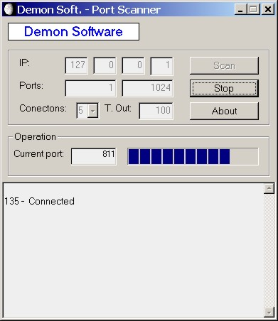



## PortScanner v\. 1\.1 from Demon Software

### Description

MultiConection Portscanner without API
 
### More Info
 
this is completed program, please vote for this source if you like it :-)

             |
---                |---
**Submitted On**   |2002-11-06 13:10:02
**By**             |[Ivan Ivanov Blagoev](https://github.com/Planet-Source-Code/PSCIndex/blob/master/ByAuthor/ivan-ivanov-blagoev.md)
**Level**          |Intermediate
**User Rating**    |5.0 (10 globes from 2 users)
**Compatibility**  |VB 6\.0
**Category**       |[Complete Applications](https://github.com/Planet-Source-Code/PSCIndex/blob/master/ByCategory/complete-applications__1-27.md)
**World**          |[Visual Basic](https://github.com/Planet-Source-Code/PSCIndex/blob/master/ByWorld/visual-basic.md)
**Archive File**   |[PortScanne1493891182002\.zip](https://github.com/Planet-Source-Code/ivan-ivanov-blagoev-portscanner-v-1-1-from-demon-software__1-40524/archive/master.zip)

